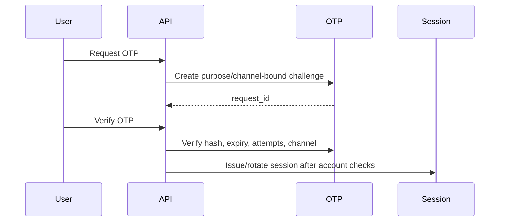

# Authentication System

All user types authenticate with mobile number and OTP.

OTP format is exactly four digits, represented as a string:

```json
{
  "request_id": "uuid",
  "otp": "1234"
}
```

The four-digit value above is an API-shape example only; the local development OTP is configured in `backend/.env` and is never returned by normal APIs.

Channels:

- `ADMIN`
- `MERCHANT`
- `CUSTOMER`
- `DELIVERY`

No password login is implemented for this phase.



The current local implementation uses MariaDB-backed OTP challenge records. Redis remains recommended for production rate limiting and distributed abuse prevention.
