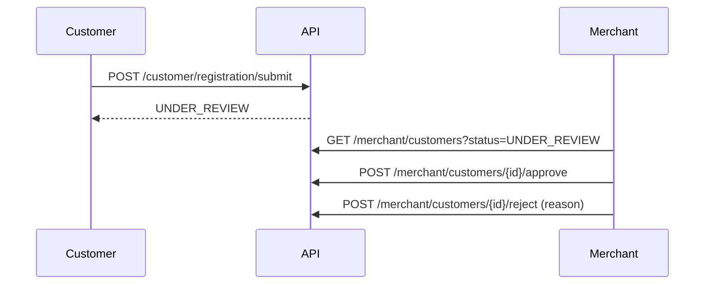

# Customer Approval Workflow

Customer applications are scoped to the merchant whose code the applicant entered.

Implemented endpoints (Merchant channel):

| Endpoint | Permission |
| --- | --- |
| `GET /api/v1/merchant/customers` | `customers.view` |
| `POST /api/v1/merchant/customers/{customer_id}/approve` | `customers.approve` |
| `POST /api/v1/merchant/customers/{customer_id}/reject` | `customers.reject` |

Permissions are assigned through roles. No seeded role grants these permissions yet; an administrator must
add them to the intended roles (the SRS names Manager and Salesperson) before merchants can review.

Scope checks: a reviewer only sees and changes applications whose `merchant_id` is the reviewer's own
active merchant. Applications of other merchants are reported as `CUSTOMER_NOT_FOUND`.

Approval and rejection are written to `audit_logs` (`customer.approved`, `customer.rejected`).

Not implemented yet: document review endpoints (`customer_documents.review`, `.approve`, `.reject`) and
customer suspension (`customers.suspend`).
