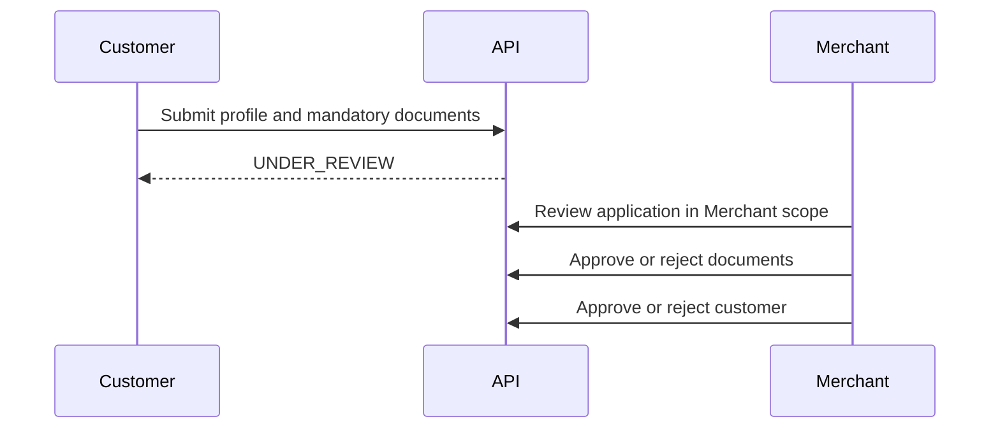

# Customer Approval Workflow

Customer applications must be scoped to an identifiable Merchant.

Approval permissions are dynamic:

- `customers.review`
- `customers.approve`
- `customers.reject`
- `customer_documents.review`
- `customer_documents.approve`
- `customer_documents.reject`

Scope checks must prevent cross-Merchant access.
