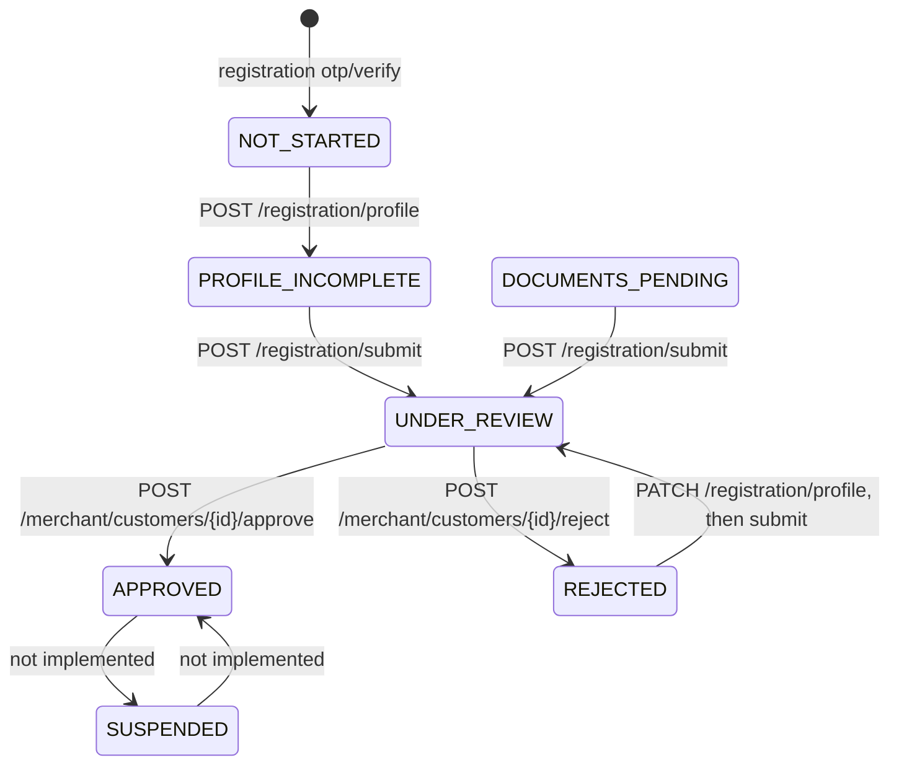

# Customer Registration

Customer registration is separate from full login. Verifying the mobile number gives a restricted
**onboarding session** that works only on `/api/v1/customer/registration/*`. A customer gets a full
Customer app session only after a merchant reviewer approves the registration (SRS FR-CM-05, FR-CM-06).

`NOT_STARTED` is not stored: it means the number is verified (user `PENDING`) but no `customer_profiles` row exists.
`DOCUMENTS_PENDING` is not reachable yet because there is no document upload API.

Rules implemented:

- The mobile number and user of a registration always come from the onboarding session; a different number in the body is refused.
- One registration per number (`REGISTRATION_PROFILE_EXISTS`, also enforced by a unique index).
- The merchant code must belong to an active, approved merchant; reviewers only see their own merchant's applications.
- Approval requires every mandatory document already on file to be approved, activates the user and assigns the `customer` role scoped to the merchant.
- Rejection requires a reason, which the applicant sees in `/registration/status`.

Open items (need a business decision or a separate feature):

- Document upload and storage for Aadhaar/PAN (Retail) and FSSAI/GST (Industrial), including masked Aadhaar storage (FR-CM-02 to FR-CM-04).
- Which seeded roles receive `customers.view`, `customers.approve` and `customers.reject` (SRS names Manager and Salesperson).
- Suspension and reinstatement APIs, address verification and pricing-tier assignment before activation (SRS 5.1).

The full transition table, error codes and app behaviour are in `docs/mobile-auth-integration.md`.
