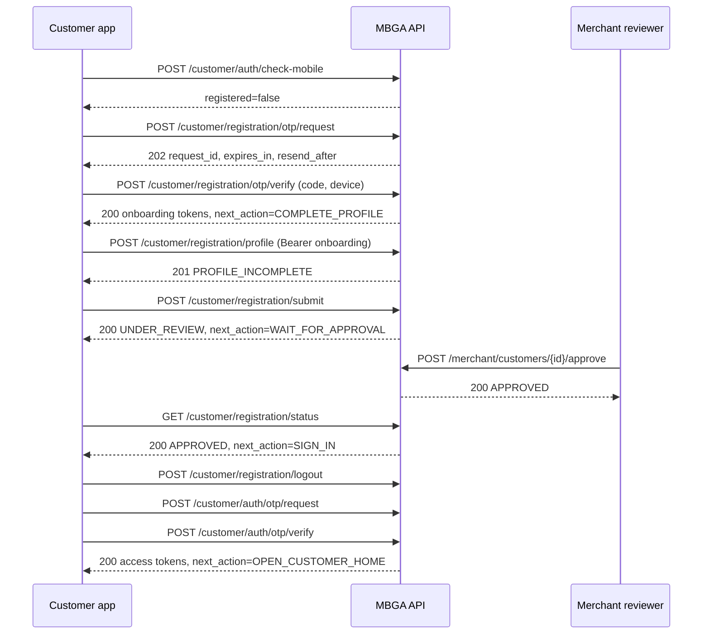
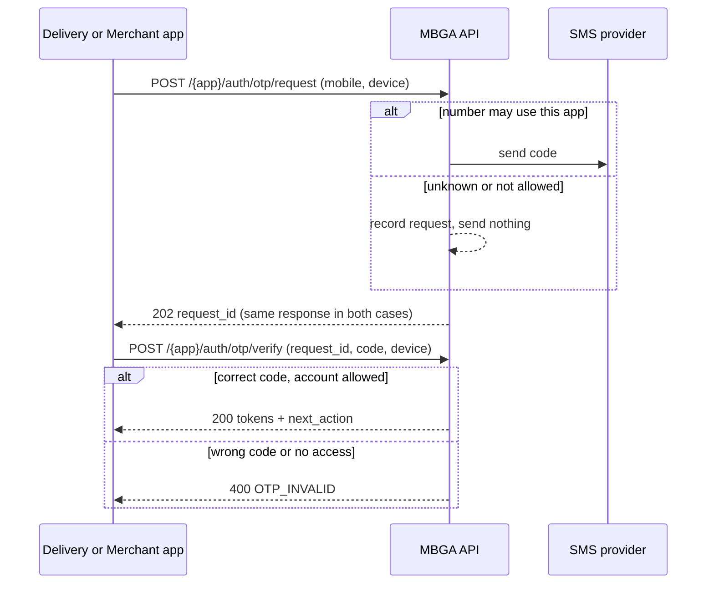
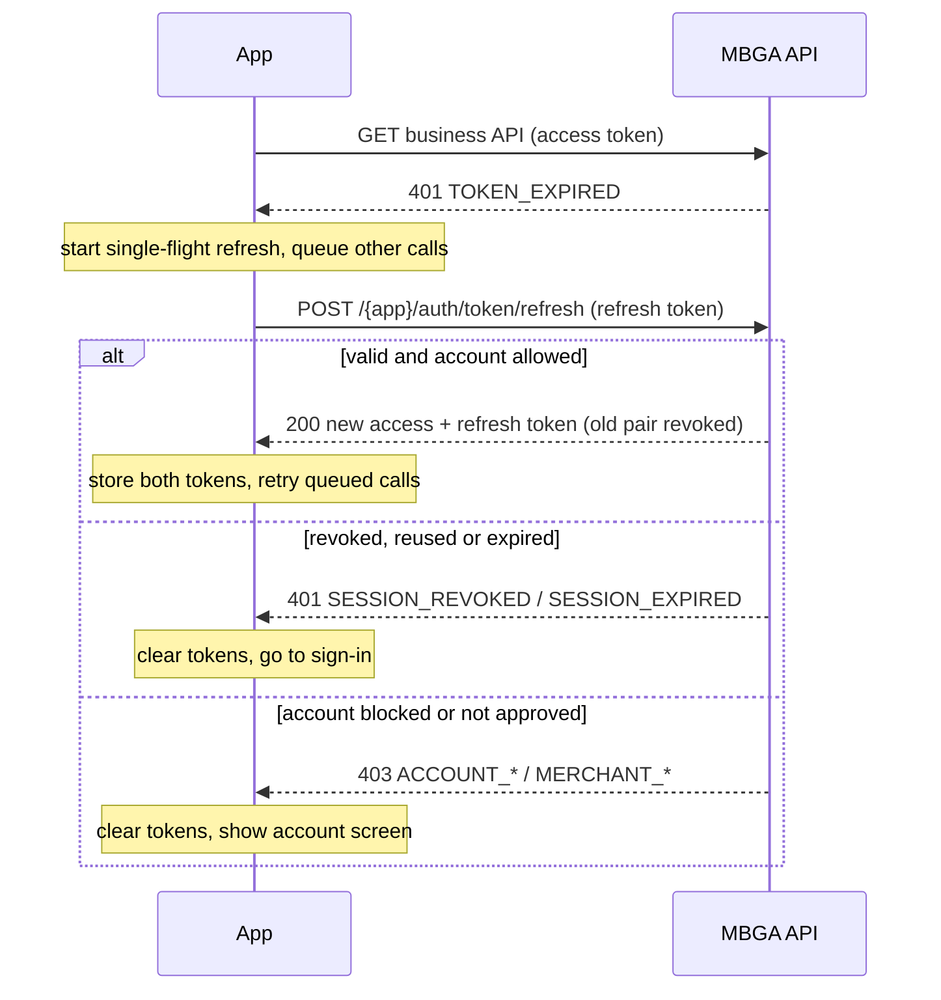
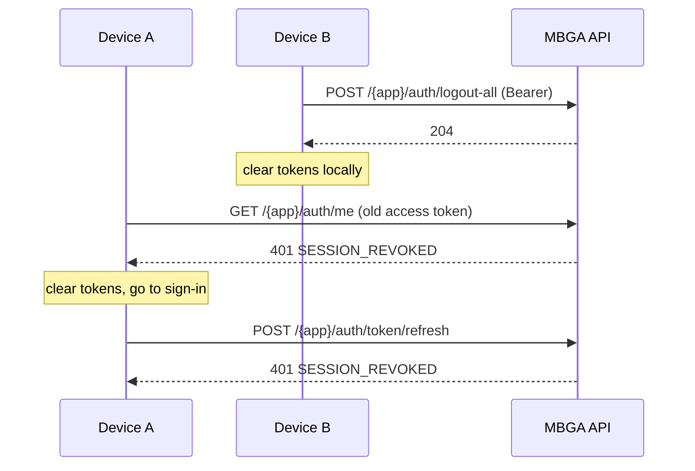

# MBGA Mobile Authentication Integration Guide

For React Native developers building the **Customer**, **Delivery Partner** (driver and helper) and **Merchant** apps.

Sign-in uses one-time codes sent to the user's mobile number. There are no passwords, so there are no forgot-password, reset-password or change-password screens.

Reference state: backend migration `20260917_0010`. The machine-readable contracts are in `docs/openapi-customer.json`, `docs/openapi-delivery.json` and `docs/openapi-merchant.json`, with matching Postman collections in the same folder.

---

## 1. Base URL and environments

| Environment | Base URL | Notes |
| --- | --- | --- |
| Local development | `http://<developer-machine-ip>:8005/api/v1` | A fixed development code may be enabled in the backend `.env`. Nothing is sent by SMS. |
| Staging | `https://<staging-host>/api/v1` | HTTPS only. Real SMS delivery is pending (see section 16). |
| Production | `https://<production-host>/api/v1` | HTTPS only. |

Each app uses its own prefix. Tokens issued for one app are rejected by the others.

| App | Sign-in prefix | Other prefixes |
| --- | --- | --- |
| Customer | `/customer/auth` | `/customer/registration` (sign-up and onboarding) |
| Delivery Partner | `/delivery/auth` | none yet |
| Merchant | `/merchant/auth` | `/merchant/delivery-users`, `/merchant/customers` |

Rules:

- Never ship a local or staging URL in a production build. Read the base URL from build configuration.
- Swagger pages (`/docs/customer`, `/docs/delivery`, `/docs/merchant`) are available only in local, development and test environments.

## 2. Request headers

| Header | When | Value |
| --- | --- | --- |
| `Content-Type` | Every request with a body | `application/json` |
| `Authorization` | `/me`, `/logout-all`, onboarding routes, all business APIs | `Bearer <access_token>` |
| `X-Request-ID` | Optional, recommended | 8 to 64 characters from `A-Z a-z 0-9 . _ -`. It is echoed in the response header and in error bodies. Include it in bug reports. |
| `User-Agent` | Recommended | For example `MBGA-Customer/1.4.0 (Android 14)`. It is stored on the session. |

Response headers you can use:

| Header | Meaning |
| --- | --- |
| `X-Request-ID` | Correlation ID for this request. |
| `Retry-After` | Seconds to wait. Sent on every 429 and 503 response. |
| `Cache-Control: no-store` | Sent on all sign-in and onboarding responses. Do not cache them. |

## 3. Endpoints

The same seven routes exist under every sign-in prefix (`{prefix}` = `/customer/auth`, `/delivery/auth`, `/merchant/auth` or `/customer/registration`).

| Method | Path | Auth | Purpose | Success |
| --- | --- | --- | --- | --- |
| POST | `{prefix}/otp/request` | none | Ask for a code | 202 |
| POST | `{prefix}/otp/resend` | none | Replace the code of an earlier request | 202 |
| POST | `{prefix}/otp/verify` | none | Check the code and receive tokens | 200 |
| POST | `{prefix}/token/refresh` | refresh token in body | Get a new token pair | 200 |
| POST | `{prefix}/logout` | refresh token in body | Sign out this device | 204 |
| POST | `{prefix}/logout-all` | Bearer | Sign out every device of this user | 204 |
| GET | `{prefix}/me` | Bearer | Current user and next screen | 200 |

Customer-only endpoints:

| Method | Path | Auth | Purpose | Success |
| --- | --- | --- | --- | --- |
| POST | `/customer/auth/check-mobile` | none | Decide between the sign-up and sign-in flows | 200 |
| GET | `/customer/registration/fields` | none | Registration form definition | 200 |
| POST | `/customer/registration/profile` | Bearer (onboarding) | Create the registration draft | 201 |
| GET | `/customer/registration/profile` | Bearer (onboarding) | Read the draft | 200 |
| PATCH | `/customer/registration/profile` | Bearer (onboarding) | Update the draft | 200 |
| POST | `/customer/registration/submit` | Bearer (onboarding) | Send the registration for review | 200 |
| GET | `/customer/registration/status` | Bearer (onboarding) | Review status and next screen | 200 |

Merchant review endpoints (used by merchant staff whose role grants `customers.view`, `customers.approve` or `customers.reject`):

| Method | Path | Purpose | Success |
| --- | --- | --- | --- |
| GET | `/merchant/customers?status=UNDER_REVIEW` | Applications for this merchant | 200 |
| POST | `/merchant/customers/{customer_id}/approve` | Approve an application | 200 |
| POST | `/merchant/customers/{customer_id}/reject` | Reject with a reason | 200 |

### Two kinds of session

| Session | Issued by | Accepted by | Rejected elsewhere with |
| --- | --- | --- | --- |
| `access` (full) | `/customer/auth/otp/verify`, `/delivery/auth/otp/verify`, `/merchant/auth/otp/verify` | That app's `/auth/*` routes and business APIs | `TOKEN_TYPE_NOT_ALLOWED` on onboarding routes; `TOKEN_CHANNEL_MISMATCH` on other apps |
| `onboarding` (restricted) | `/customer/registration/otp/verify` | `/customer/registration/*` only | `TOKEN_TYPE_NOT_ALLOWED` (401) everywhere else |

The `session_type` field in the verify and `/me` responses tells you which one you hold.

## 4. Request fields and validation

### `POST {prefix}/otp/request`

| Field | Type | Required | Rules |
| --- | --- | --- | --- |
| `mobile_number` | string | yes | Indian mobile number: 10 digits starting with 6, 7, 8 or 9. `+91`, `91`, spaces and dashes are allowed. |
| `country_code` | string | no | `+91` (default) or `91` only. |
| `device.device_id` | string | recommended | Up to 100 characters. A stable install ID that your app generates once. Used for per-device limits and shown on the session. |
| `device.device_type` | string | no | `android` or `ios`. Up to 20 characters. |
| `device.device_name` | string | no | Up to 100 characters. |
| `device.app_version` | string | no | Up to 40 characters. |
| `device.fcm_token` | string | no | Up to 512 characters. Ignored here; send it on verify (see below). |
| `login_channel` | string | no | Deprecated and ignored. The URL decides the app. |

### `POST {prefix}/otp/resend`

| Field | Type | Required | Rules |
| --- | --- | --- | --- |
| `request_id` | string | yes | The latest `request_id` for this sign-in attempt. |
| `device` | object | no | Same as above. |

### `POST {prefix}/otp/verify`

| Field | Type | Required | Rules |
| --- | --- | --- | --- |
| `request_id` | string | yes | From request or resend. |
| `otp` | string | yes | Digits only, exactly `OTP_LENGTH` digits (currently **4**). Send it as a string so leading zeros are kept (`"0427"`). |
| `device` | object | recommended | `device_id`, `device_type`, `device_name`, `app_version` and `fcm_token` are stored on the new session. |
| `mobile_number`, `country_code`, `login_channel` | | no | Deprecated and ignored. |

### `POST {prefix}/token/refresh`

| Field | Type | Required | Rules |
| --- | --- | --- | --- |
| `refresh_token` | string | yes | The latest refresh token. Each refresh token works once. |
| `device` | object | no | Send it when the push token or app version changed. Omitted values are copied from the current session. |
| `device_id` | string | no | Deprecated; use `device.device_id`. |

### `POST {prefix}/logout`

| Field | Type | Required | Rules |
| --- | --- | --- | --- |
| `refresh_token` | string | no | The refresh token of this device. |

### `POST /customer/auth/check-mobile`

| Field | Type | Required | Rules |
| --- | --- | --- | --- |
| `mobile_number` | string | yes | Same rules as `otp/request`. |

### `POST /customer/registration/profile` and `PATCH /customer/registration/profile`

| Field | Type | Required on create | Required before submit | Rules |
| --- | --- | --- | --- | --- |
| `merchant_code` | string | yes | yes | Must belong to an active, approved merchant. Case-insensitive. |
| `customer_type` | string | no | yes | `RETAIL` or `INDUSTRIAL` (case-insensitive). |
| `name` | string | no | yes | 2 to 160 characters. |
| `gst_number` | string | no | no | Up to 30 characters. |
| `mobile_number` | string | no | no | Optional. The number always comes from the session; a different number returns 403. |

`PATCH` accepts any subset of these fields and is allowed only while the status is `PROFILE_INCOMPLETE`, `DOCUMENTS_PENDING` or `REJECTED`.

### `POST /merchant/customers/{customer_id}/reject`

| Field | Type | Required | Rules |
| --- | --- | --- | --- |
| `reason` | string | yes | 3 to 500 characters. Shown to the applicant. |

## 5. Sanitized examples

All values below are placeholders.

Request a code (Delivery app):

```http
POST /api/v1/delivery/auth/otp/request
Content-Type: application/json
X-Request-ID: 7f1c2a90-3b1e-4d7a-9e55-0c1f5b2a8d11

{"mobile_number": "98XXXXXX10", "device": {"device_id": "install-uuid", "device_type": "android", "app_version": "1.0.0"}}
```

```json
HTTP/1.1 202 Accepted
{
  "request_id": "3f1c…-uuid",
  "message": "OTP request accepted",
  "expires_in": 300,
  "resend_after": 30,
  "code": "OTP_REQUEST_ACCEPTED"
}
```

Verify the code (Delivery app):

```http
POST /api/v1/delivery/auth/otp/verify
Content-Type: application/json

{"request_id": "3f1c…-uuid", "otp": "<4 digits>", "device": {"device_id": "install-uuid", "device_type": "android", "app_version": "1.0.0", "fcm_token": "<push token>"}}
```

```json
HTTP/1.1 200 OK
{
  "token": {"access_token": "<JWT>", "refresh_token": "<JWT>", "token_type": "Bearer", "expires_in": 900},
  "is_new_user": false,
  "code": "OTP_VERIFIED",
  "message": "OTP verified",
  "user_id": "8a0e…-uuid",
  "login_channel": "DELIVERY",
  "user_type": "DELIVERY_PARTNER",
  "session_type": "access",
  "role": "driver",
  "active_roles": ["driver"],
  "account_status": "ACTIVE",
  "approval_status": "APPROVED",
  "profile_completion_status": null,
  "next_action": "OPEN_DELIVERY_HOME",
  "merchant": {"id": "…-uuid", "code": "MBGA-M001", "name": "Example Gas Agency", "status": "ACTIVE", "approval_status": "APPROVED", "staff_type": null},
  "delivery_profile": {"id": "…-uuid", "delivery_user_type": "DRIVER", "employee_code": "EMP-001", "status": "ACTIVE", "approval_status": "APPROVED"},
  "customer_profile": null
}
```

Current user (Merchant app):

```json
GET /api/v1/merchant/auth/me  →  200 OK
{
  "user_id": "…-uuid",
  "display_name": "Example Manager",
  "mobile_number": "+9198XXXXXX10",
  "country_code": "+91",
  "login_channel": "MERCHANT",
  "user_type": "MERCHANT_STAFF",
  "session_type": "access",
  "role": "manager",
  "active_roles": ["manager"],
  "effective_permissions": ["delivery_users.create", "delivery_users.view"],
  "account_status": "ACTIVE",
  "approval_status": "APPROVED",
  "profile_completion_status": null,
  "next_action": "OPEN_MERCHANT_HOME",
  "merchant": {"id": "…-uuid", "code": "MBGA-M001", "name": "Example Gas Agency", "status": "ACTIVE", "approval_status": "APPROVED", "staff_type": "PRIMARY_MANAGER"},
  "delivery_profile": null,
  "customer_profile": null,
  "status": "ACTIVE",
  "profile": null
}
```

Customer registration verify:

```json
POST /api/v1/customer/registration/otp/verify  →  200 OK
{
  "token": {"access_token": "<JWT>", "refresh_token": "<JWT>", "token_type": "Bearer", "expires_in": 900},
  "is_new_user": true,
  "user_id": "…-uuid",
  "login_channel": "CUSTOMER",
  "user_type": "CUSTOMER",
  "session_type": "onboarding",
  "role": null,
  "active_roles": [],
  "account_status": "PENDING",
  "approval_status": "NOT_SUBMITTED",
  "profile_completion_status": "NOT_STARTED",
  "next_action": "COMPLETE_PROFILE",
  "merchant": null,
  "delivery_profile": null,
  "customer_profile": null,
  "code": "OTP_VERIFIED",
  "message": "OTP verified"
}
```

Create the registration draft:

```http
POST /api/v1/customer/registration/profile
Authorization: Bearer <onboarding access token>
Content-Type: application/json

{"merchant_code": "MBGA-M001", "customer_type": "RETAIL", "name": "Example Stores"}
```

```json
HTTP/1.1 201 Created
{
  "id": "…-uuid",
  "mobile_number": "+9198XXXXXX10",
  "merchant_id": "…-uuid",
  "merchant_code": "MBGA-M001",
  "customer_type": "RETAIL",
  "name": "Example Stores",
  "gst_number": null,
  "status": "PROFILE_INCOMPLETE",
  "rejection_reason": null,
  "submitted_at": null,
  "created_at": "2026-09-17T06:00:00",
  "updated_at": "2026-09-17T06:00:00"
}
```

Submit and check status:

```json
POST /api/v1/customer/registration/submit  →  200 OK
{"status": "UNDER_REVIEW", "message": "Your registration is being reviewed.", "next_action": "WAIT_FOR_APPROVAL", "rejection_reason": null}

GET /api/v1/customer/registration/status  →  200 OK
{"status": "REJECTED", "message": "Your registration was rejected. Update your details and submit again.", "next_action": "COMPLETE_PROFILE", "rejection_reason": "GST number does not match"}
```

Refresh:

```json
POST /api/v1/customer/auth/token/refresh
{"refresh_token": "<JWT>", "device": {"fcm_token": "<new push token>"}}

→ 200 OK
{"access_token": "<JWT>", "refresh_token": "<JWT>", "token_type": "Bearer", "expires_in": 900}
```

Timestamps without an offset (for example `created_at`) are UTC.

## 6. Errors

Every error from a sign-in or onboarding route has this shape:

```json
{
  "detail": {
    "code": "OTP_INVALID",
    "message": "The code is incorrect. Check the code and try again.",
    "fields": [],
    "request_id": "7f1c2a90-3b1e-4d7a-9e55-0c1f5b2a8d11"
  }
}
```

- Base app logic on `detail.code`, never on `message`.
- `message` is safe to show, but prefer your own localized text for each code.
- For validation errors, `fields` lists the invalid fields:

```json
{"detail": {"code": "VALIDATION_ERROR", "message": "Some fields are missing or invalid.", "fields": [{"field": "device.device_id", "code": "string_too_long", "message": "String should have at most 100 characters"}], "request_id": "…"}}
```

Stack traces and internal messages are never returned. An unexpected failure returns `500` with `INTERNAL_ERROR`.

### Error codes and what the app should do

| HTTP | Code | Where | App behaviour |
| --- | --- | --- | --- |
| 401 | `AUTH_REQUIRED` | Any Bearer route | No token was sent. Go to sign-in. |
| 401 | `TOKEN_EXPIRED` | Any Bearer route | Refresh once, then retry the request. |
| 401 | `TOKEN_INVALID` | Bearer routes, refresh | Clear tokens and go to sign-in. |
| 401 | `TOKEN_TYPE_NOT_ALLOWED` | Bearer routes, refresh | Wrong kind of session (for example an onboarding token on a full route). Clear tokens; start the correct flow. |
| 401 | `TOKEN_CHANNEL_MISMATCH` | Bearer routes, refresh | Token belongs to another app. Clear tokens and sign in. |
| 401 | `SESSION_REVOKED` | Bearer routes, refresh | Signed out (logout, logout-all, refresh reuse, admin action). Clear tokens and go to sign-in without an error dialog. |
| 401 | `SESSION_EXPIRED` | Bearer routes, refresh | 30-day sign-in expired. Go to sign-in. |
| 400 | `OTP_INVALID` | verify | Show "Incorrect code" and keep the code screen. Also returned when the number has no access to this app (see section 9). |
| 400 | `OTP_EXPIRED` | verify | Offer "Resend code". |
| 400 | `OTP_ATTEMPTS_EXCEEDED` | verify | This code is locked. Offer "Resend code". |
| 400 | `OTP_ALREADY_USED` | verify, resend | The code was used or replaced. Request a new code. |
| 400 | `OTP_PURPOSE_MISMATCH` | verify, resend | Unknown `request_id` or one from another flow. Restart from the number screen. |
| 403 | `CHANNEL_NOT_ALLOWED` | verify, resend | `request_id` belongs to another app. Restart from the number screen. |
| 404 | `NUMBER_NOT_REGISTERED` | verify (rare) | The account was removed after the code was sent. Show "No account found". |
| 422 | `INVALID_MOBILE_NUMBER` | request, check-mobile | Highlight the number field. |
| 422 | `VALIDATION_ERROR` | all | Highlight `fields[].field`. For `otp` it means the wrong number of digits. |
| 429 | `OTP_RESEND_TOO_SOON` | resend | Keep the timer running; use `Retry-After`. |
| 429 | `OTP_RATE_LIMITED` | request, resend | Too many codes for this number, device or network. Disable the button for `Retry-After` seconds. |
| 429 | `OTP_LOCKED` | request, resend, verify | Too many wrong codes for this number in the last hour. Disable sign-in for `Retry-After` seconds. |
| 429 | `RATE_LIMITED` | verify, check-mobile | Too many attempts from this network. Wait `Retry-After` seconds. |
| 503 | `OTP_DELIVERY_FAILED` | request, resend | SMS could not be sent. Let the user retry after `Retry-After` seconds. |
| 403 | `ACCOUNT_BLOCKED` | verify, refresh, any Bearer route | Blocked account. Show a "Contact support" screen and clear tokens. |
| 403 | `ACCOUNT_INACTIVE` | same | Account not active. "Contact support". |
| 403 | `ACCOUNT_PENDING_APPROVAL` | same | Merchant, delivery profile or customer not yet approved. "Waiting for approval" screen. |
| 403 | `ACCOUNT_REJECTED` | same | Application or merchant was rejected. "Contact support". |
| 403 | `ACCOUNT_SUSPENDED` | Customer | "Contact support". |
| 403 | `DOCUMENTS_PENDING_APPROVAL` | Customer | "Waiting for approval". |
| 403 | `MERCHANT_BLOCKED` | Merchant, Delivery | The business is blocked. "Contact MBGA support". |
| 403 | `MERCHANT_INACTIVE` | Merchant, Delivery | The business is not active. "Contact MBGA support". |
| 403 | `ROLE_NOT_ASSIGNED` | verify, refresh, Bearer routes | This person may not use this app. "Contact your administrator". |
| 403 | `PERMISSION_DENIED` | business routes, registration profile | The user may not perform this action, or the submitted mobile number is not the verified one. |
| 404 | `REGISTRATION_PROFILE_NOT_FOUND` | registration profile, submit | Show the registration form. |
| 409 | `REGISTRATION_PROFILE_EXISTS` | create profile | A draft already exists; load it with `GET /registration/profile`. |
| 409 | `REGISTRATION_NOT_EDITABLE` | update profile | Under review or approved. Show the status screen. |
| 409 | `INVALID_STATUS_TRANSITION` | submit, approve, reject | Reload the status. |
| 422 | `REGISTRATION_INCOMPLETE` | submit | Highlight `fields[]` (name, customer_type, merchant_code). |
| 422 | `MERCHANT_CODE_INVALID` | profile, submit | Highlight the merchant code field. |
| 404 | `CUSTOMER_NOT_FOUND` | merchant review | Application does not exist in this merchant's scope. |
| 409 | `DOCUMENTS_PENDING_APPROVAL` | merchant approve | Documents on file are not yet approved. |
| 500 | `INTERNAL_ERROR` | all | Generic error with the request ID. |

## 7. Secure token storage

- Store the access and refresh tokens only in the platform keystore, for example `react-native-keychain` or `expo-secure-store` (iOS Keychain, Android Keystore). Never use `AsyncStorage`, MMKV without encryption, Redux persist or files.
- Keep the access token in memory while the app runs, and read the refresh token from secure storage when needed.
- Never log tokens, codes or full mobile numbers, and never send them to analytics or crash reporting. Mask numbers as `******3210`.
- Do not decode the JWT to make decisions. Use `session_type`, `next_action` and the `/me` fields instead.
- Store the token pair atomically: write both new tokens before discarding the old ones.
- Generate `device_id` once per install and keep it in secure storage. Do not use hardware identifiers.
- Use HTTPS in staging and production. Certificate pinning is recommended for production.

## 8. Refresh strategy

| Value | Lifetime | Returned as |
| --- | --- | --- |
| Access token | 15 minutes | `expires_in` (seconds) |
| Refresh token | 30 days from sign-in or last refresh | not returned; treat it as valid until the server says otherwise |

Rules:

1. Refresh proactively about 60 seconds before `expires_in` ends, or when a request returns `401 TOKEN_EXPIRED`.
2. **Single-flight:** only one refresh call may run at a time. Queue other requests until it finishes. Each refresh token works exactly once.
3. On success, store the new pair, then retry queued requests with the new access token.
4. The previous access token stops working immediately after a refresh. Do not keep using it.
5. On any other 401 or a 403 from refresh, clear both tokens and route by the code (section 6).
6. **Replay protection.** A refresh token that was already used and is presented again more than 10 seconds later signs out the whole sign-in chain on every device that shares it. Duplicate parallel refreshes within 10 seconds are refused (401) without signing the user out. Single-flight avoids both cases.
7. Send `device.fcm_token` with the refresh request whenever Firebase gives you a new push token.

## 9. Code (OTP) screen behaviour

- Code length: `OTP_LENGTH` digits, currently 4. Use one numeric input with `textContentType="oneTimeCode"` (iOS) and SMS Retriever or autofill (Android).
- Expiry: count down from `expires_in` (300 seconds). When it reaches 0, disable "Verify" and show "Code expired — resend".
- Resend: enable "Resend code" after `resend_after` (30 seconds). Call `/otp/resend` with the latest `request_id` and **replace** your stored `request_id` with the one in the response. Older codes stop working.
- Requesting a new code from the number screen also cancels earlier codes for that number.
- Wrong code: `OTP_INVALID`. After 5 wrong entries for one code, `OTP_ATTEMPTS_EXCEEDED`; after 10 wrong entries across codes within an hour, `OTP_LOCKED`.
- Limits per hour: 5 codes per number per app; 20 code requests per network address; 10 per `device_id`; 60 verification attempts per network address. Always respect `Retry-After`.
- **Enumeration protection.** `otp/request` answers 202 for every valid number, including numbers that have no account or may not use this app (blocked, not approved, wrong app). For those numbers no SMS is sent, and any code returns `OTP_INVALID`. Word the code screen accordingly, for example: "If this number is registered for the MBGA Delivery app, we sent it a 4-digit code." After the timer ends, offer "Didn't get a code? Check the number or contact your merchant."
- The Customer app should call `check-mobile` first and use the registration flow for numbers that are not yet approved customers (section 11).

## 10. `next_action` navigation

`next_action` is returned by every `otp/verify`, `/me` and `/customer/registration/status` response. Navigate by it instead of combining status fields yourself.

| `next_action` | Open this screen | Returned when |
| --- | --- | --- |
| `OPEN_CUSTOMER_HOME` | Customer home | Full customer session; profile APPROVED; account ACTIVE; customer role; mandatory documents approved |
| `OPEN_DELIVERY_HOME` | Driver or helper home | Delivery session; account, delivery profile and merchant all active and approved |
| `OPEN_MERCHANT_HOME` | Merchant home | Merchant session; account, staff link and merchant all active and approved |
| `OPEN_ADMIN_DASHBOARD` | (web panel only) | Admin session |
| `COMPLETE_PROFILE` | Registration form | Customer onboarding: no draft, draft `PROFILE_INCOMPLETE`, or `REJECTED` (show `rejection_reason`) |
| `SUBMIT_DOCUMENTS` | Document upload | Customer draft is `DOCUMENTS_PENDING` (not reachable yet; see section 16) |
| `WAIT_FOR_APPROVAL` | "Under review" screen | Customer `UNDER_REVIEW`, or documents pending approval |
| `SIGN_IN` | Customer sign-in (`/customer/auth`) | Onboarding session of a customer who is now approved |
| `CONTACT_SUPPORT` | "Contact support" screen | Blocked, suspended, inactive or rejected accounts, and other denied states |

Blocked, suspended and rejected accounts never receive a home action.

Account state to `next_action` and error code (full sessions):

| Situation | App | HTTP | Code | `next_action` |
| --- | --- | --- | --- | --- |
| User BLOCKED | all | 403 | `ACCOUNT_BLOCKED` | CONTACT_SUPPORT |
| User INACTIVE or PENDING | Delivery, Merchant | 403 | `ACCOUNT_INACTIVE` | CONTACT_SUPPORT |
| No role for this app | Delivery, Merchant | 403 | `ROLE_NOT_ASSIGNED` | CONTACT_SUPPORT |
| Merchant BLOCKED | Delivery, Merchant | 403 | `MERCHANT_BLOCKED` | CONTACT_SUPPORT |
| Merchant not approved | Delivery, Merchant | 403 | `ACCOUNT_PENDING_APPROVAL` | WAIT_FOR_APPROVAL |
| Merchant REJECTED | Delivery, Merchant | 403 | `ACCOUNT_REJECTED` | CONTACT_SUPPORT |
| Merchant INACTIVE | Delivery, Merchant | 403 | `MERCHANT_INACTIVE` | CONTACT_SUPPORT |
| Staff link BLOCKED / other | Merchant | 403 | `ACCOUNT_BLOCKED` / `ACCOUNT_INACTIVE` | CONTACT_SUPPORT |
| Delivery profile not approved | Delivery | 403 | `ACCOUNT_PENDING_APPROVAL` | WAIT_FOR_APPROVAL |
| Delivery profile REJECTED | Delivery | 403 | `ACCOUNT_REJECTED` | CONTACT_SUPPORT |
| Delivery profile BLOCKED / other | Delivery | 403 | `ACCOUNT_BLOCKED` / `ACCOUNT_INACTIVE` | CONTACT_SUPPORT |
| Customer not yet approved | Customer | 403 | `ACCOUNT_PENDING_APPROVAL` | per section 11 |
| Customer REJECTED | Customer | 403 | `ACCOUNT_REJECTED` | COMPLETE_PROFILE |
| Customer SUSPENDED | Customer | 403 | `ACCOUNT_SUSPENDED` | CONTACT_SUPPORT |
| Customer documents not approved | Customer | 403 | `DOCUMENTS_PENDING_APPROVAL` | WAIT_FOR_APPROVAL |

These codes appear on `/me`, on refresh and on every business API as soon as the state changes. They can also appear on `otp/verify` if the state changed between sending and entering the code.

## 11. Customer onboarding

Customer statuses come from `customer_profiles.status`. `NOT_STARTED` means the number is verified but no draft exists.

| From | Trigger / API | Actor | Validation | To | Next action | Error for an invalid transition |
| --- | --- | --- | --- | --- | --- | --- |
| (no account) | `POST /customer/registration/otp/verify` | Applicant | Valid code; number not blocked | `NOT_STARTED` (user `PENDING`) | COMPLETE_PROFILE | `OTP_*`, `ACCOUNT_BLOCKED` |
| `NOT_STARTED` | `POST /customer/registration/profile` | Applicant (onboarding session) | `merchant_code` of an active, approved merchant; number taken from the session | `PROFILE_INCOMPLETE` | COMPLETE_PROFILE | `REGISTRATION_PROFILE_EXISTS` (409), `MERCHANT_CODE_INVALID` (422) |
| `PROFILE_INCOMPLETE`, `DOCUMENTS_PENDING`, `REJECTED` | `PATCH /customer/registration/profile` | Applicant | Field rules (section 4) | unchanged | COMPLETE_PROFILE | `REGISTRATION_NOT_EDITABLE` (409) |
| `PROFILE_INCOMPLETE`, `DOCUMENTS_PENDING`, `REJECTED` | `POST /customer/registration/submit` | Applicant | `name`, `customer_type` and `merchant_code` present; merchant still active | `UNDER_REVIEW` | WAIT_FOR_APPROVAL | `REGISTRATION_INCOMPLETE` (422), `INVALID_STATUS_TRANSITION` (409) |
| `UNDER_REVIEW` | `POST /customer/registration/submit` | Applicant | none (repeat is safe) | `UNDER_REVIEW` | WAIT_FOR_APPROVAL | none |
| `UNDER_REVIEW` | `POST /merchant/customers/{id}/approve` | Merchant staff with `customers.approve`, same merchant | Mandatory documents on file are approved; applicant verified the number | `APPROVED` (user `ACTIVE`, `customer` role) | SIGN_IN (onboarding) / OPEN_CUSTOMER_HOME (full) | `INVALID_STATUS_TRANSITION`, `DOCUMENTS_PENDING_APPROVAL` (409), `CUSTOMER_NOT_FOUND` (404) |
| `UNDER_REVIEW` | `POST /merchant/customers/{id}/reject` | Merchant staff with `customers.reject`, same merchant | `reason` 3 to 500 characters | `REJECTED` | COMPLETE_PROFILE | `INVALID_STATUS_TRANSITION` (409) |
| `APPROVED` | `POST /customer/auth/otp/verify` | Customer | Account active, customer role | full session | OPEN_CUSTOMER_HOME | `ACCOUNT_*` (403) |
| `APPROVED` ↔ `SUSPENDED` | not implemented | | | | CONTACT_SUPPORT while suspended | |
| → `DOCUMENTS_PENDING` | not implemented (no document upload API) | | | | SUBMIT_DOCUMENTS | |

Customer app flow:

1. Ask for the number and call `check-mobile`.
   - `registered: false`: start registration.
   - `registered: true`: the customer may be approved or still in review. Try `/customer/auth` sign-in; if no code arrives or the code is refused, offer "Continue registration", which uses the registration flow.
2. Registration flow: `/customer/registration/otp/request` → `otp/verify` → onboarding session → navigate by `next_action`.
3. While `WAIT_FOR_APPROVAL`, poll `GET /customer/registration/status` when the app opens (not in a tight loop).
4. When the status reports `SIGN_IN`, discard the onboarding tokens (call `/customer/registration/logout`) and run the customer sign-in flow.

The onboarding session can be refreshed with `/customer/registration/token/refresh` and stays restricted after refreshing.

Pending Customer registrations must keep using the onboarding session for registration status.
The full Customer login flow intentionally returns `403 ACCOUNT_PENDING_APPROVAL` until a
Merchant reviewer approves the application. Treat that response as expected: route the user
back to the registration-status screen using their valid onboarding session. If the
onboarding access token expires before review completes, refresh it with
`/customer/registration/token/refresh`; if the refresh token is gone or expired, restart the
existing `/customer/registration/otp/request` -> `/otp/verify` flow for the same mobile
number to obtain a new onboarding session. Do not send onboarding tokens to full Customer
APIs, and do not expect pending Customers to receive full Customer app sessions.

Approval is strict for every Customer record, including old seed or migrated records. Retail
approval requires business name, owner name, valid delivery address, Aadhaar document and
number, PAN document and number, finalized uploads, acceptable scan status and no rejected
mandatory document. Industrial approval requires business name, owner name, valid delivery
address, FSSAI document and number, GST document and GSTIN, exactly one active primary site,
finalized uploads, acceptable scan status and no rejected mandatory document. Incomplete
legacy records remain pending until completed or formally migrated.

KYC document metadata and list responses expose only masked identifiers such as
`documents[].numberMasked`. Broad lists and errors must not echo full Aadhaar, PAN, FSSAI or
GSTIN values. `customer.gstin` is reserved for authorized owner/full-profile contexts,
authorized Merchant detail/review contexts for that Merchant, and future legal invoice
generation. It is not a search/list field.

Document scan policy is environment-gated. Staging and production approval require
`scan_status=CLEAN`; `PENDING`, `FAILED`, `INFECTED`, `SKIPPED` or unknown states block with
`DOCUMENT_SCAN_PENDING`. Local/test may accept `SKIPPED` only when
`ALLOW_SKIPPED_KYC_SCAN_IN_LOCAL=true` is explicitly configured.

Staged uploads that are never attached are cleaned by
`python scripts/cleanup_orphaned_kyc_uploads.py --retention-hours <hours>`. The command is a
dry-run by default; add `--execute` to delete expired unfinalized uploads and their storage
objects. Production should schedule it daily after confirming dry-run output.

## 12. Delivery Partner sign-in flow

Drivers and helpers are created by their merchant; there is no self-registration.

1. Number screen → `POST /delivery/auth/otp/request` with `device`.
2. Code screen → `POST /delivery/auth/otp/verify` with `device` (including `fcm_token`).
3. Navigate by `next_action`: `OPEN_DELIVERY_HOME` or an account screen.
4. Show `delivery_profile.delivery_user_type` (DRIVER or HELPER), `employee_code` and `merchant.name` in the profile header.
5. On app start: read the refresh token from secure storage → refresh → `GET /delivery/auth/me` → navigate.
6. Sign out: `POST /delivery/auth/logout` with the refresh token, then clear local data. "Sign out of all devices": `POST /delivery/auth/logout-all`.

A merchant blocking the driver or helper, or MBGA blocking the merchant, takes effect on the next request (`ACCOUNT_BLOCKED` or `MERCHANT_BLOCKED`).

## 13. Merchant sign-in flow

Merchant staff are created by MBGA administrators; there is no self-registration.

1. `POST /merchant/auth/otp/request` → `otp/verify` → navigate by `next_action`.
2. Use `merchant` (id, code, name) for the business header and `role` / `effective_permissions` from `/me` to show or hide features.
3. `ACCOUNT_PENDING_APPROVAL` means the business is not approved yet; `MERCHANT_BLOCKED` means it is blocked.
4. Refresh, logout and logout-all work as for the Delivery app.

## 14. Logout and revoked sessions

| Action | Call | Effect |
| --- | --- | --- |
| Sign out this device | `POST {prefix}/logout` with `refresh_token` | This session ends immediately; its access token is rejected on the next request; its push token is removed. Always returns 204, even if the token was already invalid, so sign-out can never get stuck. |
| Sign out everywhere | `POST {prefix}/logout-all` with `Authorization` | Every session of this user (all apps) ends immediately. |
| Admin or merchant signs a user out, blocks a user, or blocks a merchant | (back office) | The user's next request returns `SESSION_REVOKED` or the account code. |

App rules:

- Clear tokens locally even if the logout call fails (for example when offline).
- Unregister the device from push notifications locally as well.
- A `SESSION_REVOKED` response on any call means "signed out": go to sign-in without an error dialog.

## 15. Sequence diagrams

### Customer registration and first sign-in



### Existing user sign-in



### Token refresh



### Logout and revoked-token handling



## 16. Known limitations

| Item | Status | Impact on the apps |
| --- | --- | --- |
| Real SMS delivery | **Blocked by SMS vendor configuration.** The provider interface, timeouts, retries and startup guard exist; the vendor call is not implemented. | Outside local environments, `otp/request` returns `503 OTP_DELIVERY_FAILED` until a vendor is integrated. Local development uses the fixed development code. |
| Customer document upload (Aadhaar/PAN, FSSAI/GST) | Not implemented (no storage service or upload API). | `SUBMIT_DOCUMENTS` is never returned yet. Approval currently checks only documents already on file. |
| Customer suspension and reinstatement | No API. | `ACCOUNT_SUSPENDED` appears only if set directly by support. |
| Reviewer permissions | `customers.view`, `customers.approve` and `customers.reject` are not granted to any seeded role. | An administrator must assign them (for example to the Manager or Salesperson role) before merchants can review applications. |
| Refresh-token lifetime | Not returned in responses. | Treat 30 days as a guide and rely on server responses. |
| Terms acceptance, account deletion, per-device session list | Not implemented. | No API yet. |

## 17. Contract changes for existing integrations

| Area | Before | Now | Migration |
| --- | --- | --- | --- |
| Unknown number on `otp/request` | `404 NUMBER_NOT_REGISTERED` | `202` (no SMS); verify returns `400 OTP_INVALID` | Remove the "number not found" branch after request. Use `check-mobile` in the Customer app. |
| Blocked / not-approved / wrong-app number on `otp/request` | `202` and code sent, then `403` on verify | `202`, no SMS, `400 OTP_INVALID` on verify | Show the "If this number is registered…" hint. |
| Missing token | `401 SESSION_EXPIRED` | `401 AUTH_REQUIRED` | Treat both as "go to sign-in". |
| Malformed or tampered token | `401 SESSION_EXPIRED` | `401 TOKEN_INVALID` | Same handling. |
| Expired access token | `401 SESSION_EXPIRED` | `401 TOKEN_EXPIRED` | Refresh on `TOKEN_EXPIRED`. |
| Token from another app | `401 SESSION_REVOKED` | `401 TOKEN_CHANNEL_MISMATCH` | Clear tokens. |
| Refresh token used as access token | `401 SESSION_REVOKED` | `401 TOKEN_TYPE_NOT_ALLOWED` | Clear tokens. |
| Garbage refresh token | `401 SESSION_EXPIRED` | `401 TOKEN_INVALID` | Clear tokens. |
| Access token after logout, logout-all, refresh or block | still accepted for up to 15 minutes | rejected immediately | None; this is the fix. |
| Onboarding token on `/customer/auth/me` | accepted | `401 TOKEN_TYPE_NOT_ALLOWED` | Use `/customer/registration/me`. |
| Onboarding refresh | `403 ACCOUNT_INACTIVE` | `200` (stays onboarding) | None. |
| `POST /customer/registration/profile` | no auth; `mobile_number` required | onboarding Bearer required; number from session; `merchant_code` must be valid | Send the onboarding token. |
| `GET /customer/registration/status?mobile_number=` | no auth, any number | onboarding Bearer required; query parameter ignored; adds `next_action` and `rejection_reason` | Send the onboarding token. |
| Blocked merchant at sign-in | `ACCOUNT_PENDING_APPROVAL` | `MERCHANT_BLOCKED` | Add the new code. |
| `role` in verify and `/me` | always `null` (enum type) | primary role code string, e.g. `driver` | Read it as a string. |
| `is_new_user` | always `false` | `true` when registration verification created the account | None. |
| `merchant`, `profile` in `/me` | always `null` | typed objects; `profile` deprecated in favour of `delivery_profile` / `customer_profile` | Switch to the new fields. |
| `status` in `/me` | account status | unchanged, deprecated; use `account_status` | Switch when convenient. |
| New fields | none | `user_type`, `session_type`, `account_status`, `approval_status`, `profile_completion_status`, `next_action`, `delivery_profile`, `customer_profile` | Use them for navigation. |
| Error body | `{"detail": {"code", "message"}}`, sometimes text or a list | always `{"detail": {"code", "message", "fields", "request_id"}}` on sign-in and onboarding routes | Read `detail.code`; read `detail.fields` for validation. |
| Error `message` | code in title case ("Otp Invalid") | user-facing sentence | Do not match on message text. |
| `active_roles` | could repeat | distinct, primary role first | None. |
| Rate limits | per number only | also per network address and per device, with `Retry-After`; `OTP_LOCKED` added | Handle 429 generically. |
| Refresh request | `device_id` only | `device` object (push token, app version); `device_id` deprecated | Send `device` when it changes. |
